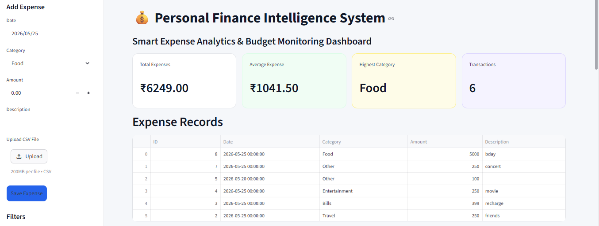
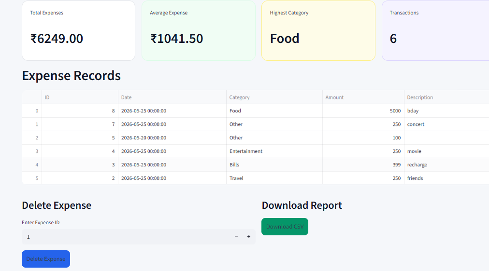

# Personal Finance Intelligence System

## Overview

Personal Finance Intelligence System is a smart expense analytics dashboard built using Python, Streamlit, Pandas, Plotly, and SQLite.

The application helps users track expenses, monitor budgets, visualize spending trends, and gain financial insights through interactive dashboards.

---

## Features

- Expense Tracking
- Budget Monitoring
- Expense Forecasting
- Expense Insights
- CSV Upload & Download
- Interactive Charts
- Dynamic Filters
- Expense Deletion
- KPI Analytics Dashboard

---

## Technologies Used

- Python
- Streamlit
- Pandas
- Plotly
- SQLite

---

## Dashboard Screenshots

### Main Dashboard

### Expense Records

### Financial Insights

---

## Sample Dataset

A sample dataset is included for testing the dashboard.

File:
sample_expense_dataset.csv

---

## How to Run the Project

### Step 1 — Install Dependencies

pip install -r requirements.txt

### Step 2 — Run Streamlit App

streamlit run app.py

---

## Project Structure

personal-finance-intelligence-system/
│
├── app.py
├── database.py
├── README.md
├── requirements.txt
├── sample_expense_dataset.csv
│
├── database/
│   └── expenses.db
│
├── screenshots/
│   ├── main-dashboard.png
│   ├── expense-records-dashboard.png
│   ├── financial-insights-dashboard.png
│
├── assets/
├── data/
├── notebooks/
├── reports/
└── sql/

---

## Future Improvements

- User Authentication
- AI-based Expense Prediction
- Cloud Deployment
- Category-wise Budget Tracking
- PDF Report Generation